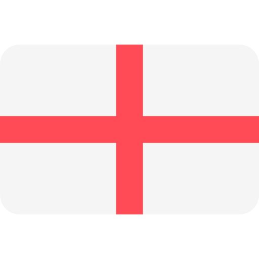
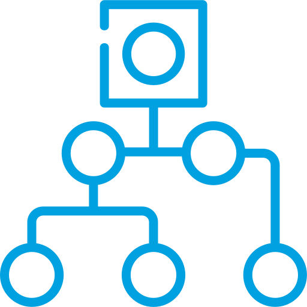
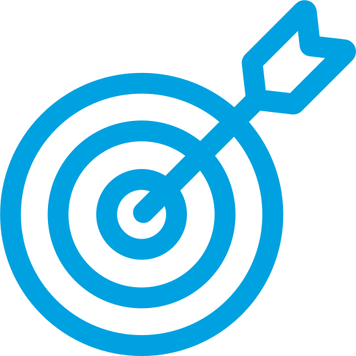
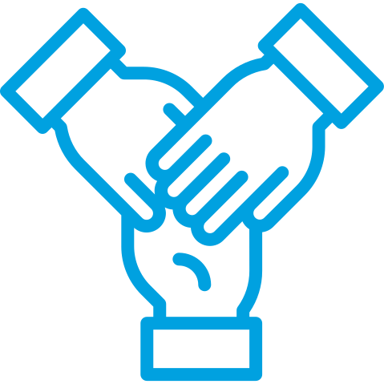
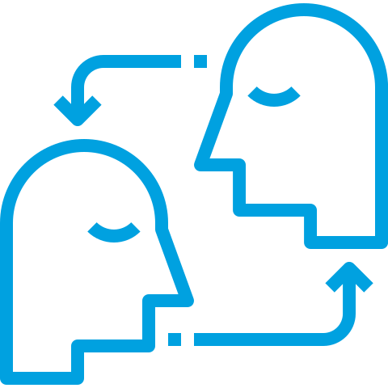
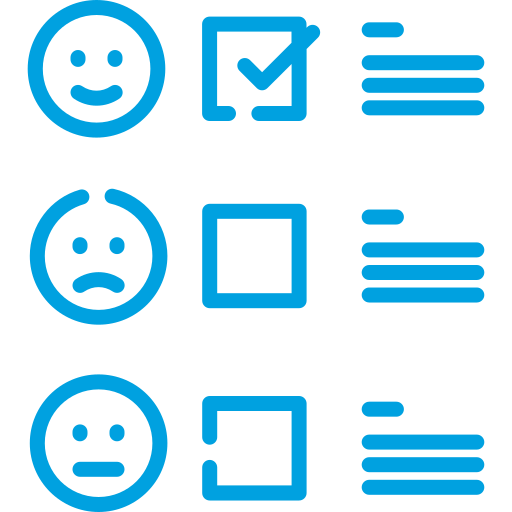
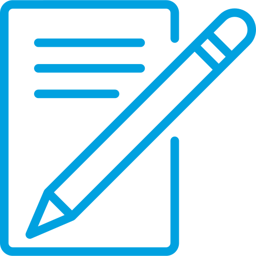

<!---
wellingtonmnf/wellingtonmnf is a ✨ special ✨ repository because its `README.md` (this file) appears on your GitHub profile.
You can click the Preview link to take a look at your changes.
--->

<!-- 
COLOR CODE

Azul (Salesforce) = 00A1E0 
-->

<!DOCTYPE html>
<html lang="pt-br">

<head>
        <meta charset="utf-8"/>
        <meta name="viewport" content="width=device-width, initial-scale=1">
</head>

<body>

<!---APRESENTAÇÃO--->
<section id="apresentacao">

## Olá, eu sou o [**Wellington**](https://github.com/wellingtonmnf) 👋

- :man_technologist: Estou em processo de transição de carreira, estudando para me tornar um Desenvolvedor Salesforce
- 🌱 Eu estou aprendendo atualmente: Salesforce (CRM), Apex, SOQL, HTML5, CSS3 e JavaScript
- 📚 Iniciei em 2025 uma Pós-Graduação em Inteligência Artificial e Ciência de Dados!
- 👀 Me interesso por: Programação, Desenvolvimento Web, Análise de Dados, Inteligêngia Artificial, Design Gráfico e Arquitetura e Urbanismo
- :thumbsup: Também gosto de escutar músicas e podcasts :headphones:, viajar e conhecer novos lugares :airplane::world_map::national_park:, sair com os amigos :man: :bearded_person: :woman: :curly_haired_woman: e do E.C. Vitória! :lion: :red_circle: :black_circle: :soccer:
- :open_book: Você pode acompanhar minha transição de carreira lendo o meu blog [**Algoritmo Biomimético**](https://medium.com/algoritmo-biomimetico) :electron:

#### #OpentoWork :man_mechanic:

Depois de anos atuando como Arquiteto e Urbanista, retorno aos estudos na área de T.I. para construir um portfólio e me reinserir no mercado de trabalho.

Encaro essa mudança com muita disposição e entusiasmo, aprendendo, contribuindo e evoluindo diante das necessidades, das demandas e das oportunidades emergentes.

Sou proficiente em softwares de edição de imagens e de modelagem 3D.

</section>

<section id="contato">

### :iphone: Contatos: 

 

<!---->
<!---->

</section>

<!---CURRÍCULO--->

<section id="curriculo">

<h3>:page_facing_up: CURRÍCULO | <a href="curriculo/Currículo - T.I. (SALESFORCE) - RGB - A4.pdf">[PDF]</a></h3>

<h4>:mortar_board: FORMAÇÃO:</h4>

   #### :man_student: Acadêmica

   * :books: **Pós-Graduação em Inteligência Artificial e Ciência de Dados (EAD) | _Em curso_**  
     :classical_building: *Universidade Salvador (UNIFACS)* | :calendar: *2025.2 - 2026.1*

   * :books: **Bacharelado em Arquitetura e Urbanismo**  
     :classical_building: *Universidade Salvador (UNIFACS)* | :calendar: *2010 - 2015*

   * :books: **Curso Técnico em Desenvolvimento de Software**  
     :classical_building: *SENAI - CETIND* | :calendar: *2007 - 2008*

   * :books: **Ensino Médio Completo**  
     :classical_building: *Escola Reitor Miguel Calmon - SESI* | :calendar: *2005 - 2007*

  #### :dart: Complementar

   * :books: **Estruturas para Arquitetos (:hourglass: 48 horas)**  
     :classical_building: *SENAI - CIMATEC* | :calendar: *2017*

   * :books: **Curso Básico de REVIT Architecture (:hourglass: 30 horas)**  
     :classical_building: *Andrade Casaes Arquitetura* | :calendar: *2014*

   * :books: **Manutenção de Microcomputadores (:hourglass: 600 horas)**  
     :classical_building: *SENAI* | :calendar: *2006*  

<h4>:necktie: EXPERIÊNCIA PROFISSIONAL:</h4>

   #### :arrows_counterclockwise: Transição de Carreira | Pausa na carreira

   :calendar: **ago de 2022 - o momento**  
   :mailbox_closed: *Salvador, Bahia*

   + Pesquisa e estudo de mercado;
   + Retorno dos estudos na área de T.I. em busca de reinserção no mercado;

   + Cursos livres:
     - Lógica de Programação; 
     - Java, POO;
     - HTML5, CSS3;
     - MySQL;
     - Python;

   + Imersões Alura:  
     - Dados com Python | Análise de Dados;
     - IA Generativa | Gemini, Google AI Studio (2x);
     - Dev_ com Gemini | Front-end;
     - Dev_ com Gemini | Back-end;

   + Estudo em Salesforce:
     - Apex, SOQL;
     - Livro "Salesforce para não programadores e programadores";
     - Livro "Salesforce APEX - Implemente soluções com padrões e técnicas de Orientação a Objetos"   

   #### :construction_worker: Arquiteto | Autônomo

   :calendar: **jan de 2016 - ago de 2022 · :hourglass: 6 anos 8 meses**  
   :mailbox_closed: *Salvador e Região, Bahia*

   Atuação em:

   + Projetos residenciais;
   + Projetos de arquitetura de interiores;
   + Execução de reformas;
   + Laudos Técnicos;

   #### :postbox: Estagiário de Arquitetura | Correios

   :calendar: **jun de 2012 - jun de 2014 · :hourglass: 2 anos 1 mês**  
   :mailbox_closed: *Salvador, Bahia*

   + Auxílio na digitalização de croquis e cadastros;
   + Auxílio na realização de cadastro;
   + Auxílio no desenvolvimento de projetos arquitetônicos em AutoCAD;
   + Auxílio na criação de Layouts;
   + Foco em adaptar espaços para cumprir requisitos de acessibilidade diante Termo de Compromisso de Ajuste de Conduta assinado pelos Correios, para democratizar o acesso de todas as pessoas as suas instalações;
   + Co-autor no desenvolvimento do projeto de reforma e adequação ao TCAC da agência dos Correios AC Correntina, situada no município de Correntina - BA;

  

<h4>:speaking_head: IDIOMAS</h4>

<table id="table-lang" align="center" border="0">
<tr align="center">
  <td><strong>Idioma</strong></td>
  <td><strong>Leitura</strong></td>
  <td><strong>Escrita</strong></td>
  <td><strong>Conversação</strong></td>
</tr>
<tr align="center">
  <td> Português</td>
  <td><em>Nativo</em></td>
  <td><em>Nativo</em></td>
  <td><em>Nativo</em></td>
</tr>
<tr align="center">
  <td> Inglês</td>
  <td><em>Bom</em></td>
  <td><em>Bom</em></td>
  <td><em>Intermediário</em></td>
</tr>
<tr align="center">
  <td> Espanhol</td>
  <td><em>Bom</em></td>
  <td><em>Baixo</em></td>
  <td><em> - </em></td>
</tr>
</table>

</section>   

<!---TECNOLOGIAS/HABILIDADES--->

<section id="tech-specs">

<h3>:card_index_dividers: TECHS | SKILLS</h3>

<h4>HARD SKILLS :triangular_ruler:</h4>

#### Programação:

<!---->

---
#### Desenvolvimento Web:

<!---->

 
 

---

#### Banco de Dados:

--- 

#### SO:

<!---->

---
#### Virtualização:

---
#### Versionamento:

---
#### Edição de código:

<!---->
<!---->
<!---->
<!---->

---
#### Navegadores:

<!---->
<!---->
<!---->

---
#### Inteligência Artificial:

<!---->

---
#### CRM:

---
#### Conteinerização:

<!---->

---
#### Design gráfico:

<!---->
<!---->

---
#### Escrita:

---
#### Planejamento | Pacote Office:

---
#### Manutenção de Micro: 

---
#### BIM | CAD | Modelagem 3D | Renderização:

---

  

<h4>SOFT SKILLS :leaves:</h4>

<table id="soft-skills" align="center" border="0">
  <tr align="center">
    <td width="150px" height="50px"><strong>Organização</strong></td>
    <td width="150px" height="50px"><strong>Determinação</strong></td>
    <td width="150px" height="50px"><strong>Diplomacia</strong></td>
    <td width="150px" height="50px"><strong>Comprometimento</strong></td>
  </tr>
  <tr align="center">
    <td width="150px" height="100px"></td>
    <td width="150px" height="100px"></td>
    <td width="150px" height="100px"></td>
    <td width="150px" height="100px"></td>
  </tr>
  <tr align="center">
    <td width="150px" height="50px"><strong>Empatia</strong></td>
    <td width="150px" height="50px"><strong>Auto-avaliação</strong></td>
    <td width="150px" height="50px"><strong>Busca por aprendizado</strong></td>
    <td width="150px" height="50px"><strong>Comunicação Escrita</strong></td>
  </tr>
  <tr align="center">
    <td width="150px" height="100px"></td>
    <td width="150px" height="100px"></td>
    <td width="150px" height="100px"></td>
    <td width="150px" height="100px"></td>
  </tr>
</table>

  

<h4>MAD SKILLS 🤹‍♂️</h4>

## *"Organização, criatividade e expresão: a ordem em meio ao caos."* 

Estou sempre buscando otimizar as rotinas da minha vida de forma organizada, sem deixar de explorar minha criatividade com ideias e emoções através da escrita e da arte digital.

* **📦🗃️ Organização Minimalista:** A filosofia minimalista me permite focar no essencial, eliminando o excesso ao meu redor e otimizando meu tempo e energia. Com isso, consigo gerenciar os projetos e tarefas com eficiência, mantendo a organização e clareza em meus pensamentos, metas e ações. 

* **🎨🖼️ Expressão Artística Digital:** A criação de imagens como papéis de parede personalizados, explorando temas que me atraem, é uma das formas de expressar minha criatividade. Combinando a inspiração com minhas habilidades com softwares de edição de imagem, transformo ideias em arte digital que reflete meus interesses e estilo pessoal. 

* **✒️📝 Escrita como Desabafo:** A escrita, tanto de textos como de poemas, sempre foi minha válvula de escape para processar emoções e pensamentos. Através dela, consigo organizar ideias, refletir sobre experiências e expressar sentimentos de forma genuína. Essa habilidade me permite ter um olhar crítico, analítico e aberto sobre o mundo, além de fortalecer minha capacidade de comunicação escrita. 

* **💻📱 Experimentação Tecnológica:** Sou fascinado pelas possibilidades que a tecnologia oferece e busco sempre aprimorar meus conhecimentos nesse universo. Adoro conhecer e explorar novos produtos, ferramentas e plataformas, testando recursos e aprendendo sobre as últimas tendências. A paixão por tecnologia me impulsiona a buscar soluções inovadoras e me manter atualizado com as mudanças constantes do mercado. 
---
Acredito que a combinação dessas *"mad skills"* me permite ter uma visão equilibrada e holística, adaptando-me com flexibilidade às diferentes demandas do ambiente de trabalho. Minha paixão por organização, criatividade e expressão me impulsiona a contribuir ativamente e buscar soluções inovadoras para as situações mais variadas. 

<h4>SETUPS :desktop_computer::keyboard::computer_mouse:</h4>

#### :desktop_computer: SETUP \#01
* **OS:** Windows 11
* **Desktop:** ASUS TUF GAMING B550M-PLUS (Wi-Fi) | Ryzen 5 5600X | GeForce 3070Ti | RAM: 32 GB | SSD: 2,5 TB
* **Navegadores:** Vivaldi | Brave | Firefox <!--| Edge | Chrome | DuckDuckGo | Zen-->
--- 
#### :computer: SETUP \#02
* **OS:** Fedora 42
* **Laptop:** Dell Vostro 3550 | i5-2430M | Intel HD Graphics 3000 | RAM: 16 GB | SSD: 1 TB
* **Navegadores:** Vivaldi | Brave | Firefox <!--| Chromium-->
---
#### :wrench: FERRAMENTAS
* **Editores de código:** VS Code | PyCharm | IntelliJ IDEA
* **Banco de dados:** MySQL Workbench | PGAdmin4
* **Versionamento:** Git 
* **Repositório:** GitHub
* **Plataformas:** Java | Node.js | XAMPP
* **Virtualização:** VirtualBox
* **Design:** Illustrator | Photoshop
* **Planejamento:** Notion
* **Office:** ONLYOFFICE
* **Inteligência Artificial:** Perplexity | Gemini | Google AI Studio | ChatGPT

 

</section>

<!---STATUS--->

<section id="status">   

<h3>:bar_chart: MÉTRICAS | GITHUB</h3>

<!--
--- -->

<!-- -->

---

<!--  -->

<!--  -->

--- 

<!--  -->

--- 

<!--  -->

--- 

<!--  -->

--- 

<!--  

--- -->

<!--  

--- -->

<!--  -->

</section>

<!---RODAPÉ--->

<footer id="rodape">

### :bookmark_tabs: REFERÊNCIAS

* :newspaper: ***Notícias:*** [The News](https://thenewscc.com.br/) **|** [IA Sob Controle](https://www.linkedin.com/newsletters/ia-sob-controle-7206276550437007360/) **|** [Tecnoblog](https://tecnoblog.net/) **|** [Diolinux](https://diolinux.com.br/) **|** [TechCrunch](https://techcrunch.com/) **|** [The Verge](https://www.theverge.com/) **|** [TestingCatalog](https://www.testingcatalog.com/) **|** [Futurism](https://futurism.com/) **|** [The Decoder](https://the-decoder.com/)
* :pencil: ***Blogs:*** [Tera](https://blog.somostera.com/) **|** [Data Hackers](https://www.datahackers.com.br/blog) **|** [Curso em Vídeo](https://www.cursoemvideo.com/blog/)  
* :studio_microphone: ***Podcasts:*** [Tecnocast](https://tecnoblog.net/tecnocast/) **|** [Dev Sem Fronteiras](https://www.devsemfronteiras.tech/podcasts/) **|** [Data Hackers](https://www.datahackers.com.br/podcast) **|** [Diocast](https://diolinux.com.br/diocast) **|** [CanalTech](https://canaltech.com.br/podcast/podcast-canaltech/) **|** [Porta 101](https://canaltech.com.br/podcast/porta-101/) **|** [NerdTech](https://www.jovemnerd.com.br/podcasts/nerdtech)
* :books: ***Livros:*** [Essencialismo](https://sextante.com.br/livros/essencialismo/) **|** [A coragem de não agradar](https://sextante.com.br/livros/a-coragem-de-nao-agradar/)
* :microphone: ***Bandas:*** [Audioslave](https://www.youtube.com/@AudioslaveOfficial/featured) **|** [Linkin Park](https://www.youtube.com/channel/UCZU9T1ceaOgwfLRq7OKFU4Q) **|** [Green Day](https://www.youtube.com/@GreenDay)
* :musical_note: ***Música:*** [*Simple Man (Acoustic Version)* - **Shinedown**](https://www.youtube.com/watch?v=rgFQ6WmxdMs)

---

<h3>:earth_americas: Com muito ORGULHO, com muito AMOR, eu sou de...</h3>

</footer>

</body>
</html>
