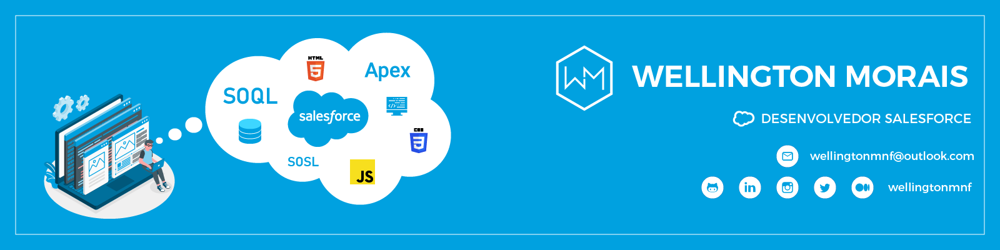

<!DOCTYPE html>
<html lang="pt-br">

<head>
        <meta charset="utf-8"/>
        <meta name="viewport" content="width=device-width, initial-scale=1">
</head>

<body>

<!---APRESENTAÇÃO--->
<section id="apresentacao">

- 👋 Olá, eu sou o [**Wellington**](https://github.com/wellingtonmnf)
- 🌱 Eu estou aprendendo atualmente Salesforce, Apex, HTML5, CSS3 e JavaScript
- 👀 Me interesso por: Programação, Desenvolvimento Web, Salesforce, Análise de Dados, Design Gráfico e Arquitetura e Urbanismo
- :man_technologist: Estou em transição de carreira, estudando para me tornar um Programador Salesforce
- 📫 Você pode acompanhar minha transição lendo o meu blog [**Algoritmo Biomimético**](https://medium.com/algoritmo-biomimetico) 

---

Sou um profissional que se encontra em transição de carreira. Depois de anos na área de Arquitetura e Urbanismo, retorno aos estudos de T.I. para construir um portfólio e me reinserir no mercado.

Tenho disposição para encarar mudanças. Aprendo, contribuo e evoluo diante das necessidades das demandas e oportunidades emergentes.

Proficiente em softwares de edição de imagem e modelagem 3D.

---

### Contatos:

 

</section>

 

---

<!---FORMAÇÃO E EXPERIÊNCIA PROFISSIONAL--->

<section id="curriculo">

<h2>FORMAÇÃO E EXPERIÊNCIA</h2>

<h3>Formação Acadêmica:</h3>

   * :classical_building: **Universidade Salvador (UNIFACS)**  
     :books: *Bacharelado em Arquitetura e Urbanismo | :calendar: 2010 - 2015*

   * :classical_building: **SENAI - CETIND**  
     :books: *Curso Técnico em Desenvolvimento de Software | :calendar: 2007 - 2008*

   * :classical_building: **Escola Reitor Miguel Calmon - SESI Retiro**  
     :books: *Ensino Médio | :calendar: 2005 - 2007*

<h3>Cursos Complementares:</h3>

   * :books: **Estruturas para Arquitetos (:hourglass: 48 horas)**  
     :classical_building: *SENAI - CIMATEC | :calendar: 2017*

   * :books: **Curso Básico de REVIT Architecture (:hourglass: 30 horas)**  
     :classical_building: *Andrade Casaes Arquitetura | :calendar: 2014*

   * :books: **Manutenção de Microcomputadores (:hourglass: 600 horas)**  
     :classical_building: *SENAI | :calendar: 2006*

<h3>Experiência Profissional:</h3>

   * :arrows_counterclockwise: **Transição de carreira | Pausa na carreira**

     *:calendar: ago de 2022 - o momento · :hourglass: 5 meses*  
     :mailbox_closed: *Salvador, Bahia*

     + Pesquisa e estudo de mercado;
     + Retorno dos estudos na área de T.I. em busca de reinserção no mercado;

   * :construction_worker: **Arquiteto | Autônomo**

     :calendar: *jan de 2016 - ago de 2022 · :hourglass: 6 anos 8 meses*  
     :mailbox_closed: *Salvador e Região, Brasil*

     Atuação em:

     + Projetos residenciais;
     + Projetos de arquitetura de interiores;
     + Execução de reformas;
     + Laudos Técnicos;

   * :postbox: **Estagiário de Arquitetura | Correios**

     :calendar: *jun de 2012 - jun de 2014 · :hourglass: 2 anos 1 mês*  
     :mailbox_closed: *Salvador*

     + Auxílio na digitalização de croquis e cadastros;
     + Auxílio na realização de cadastro;
     + Auxílio no desenvolvimento de projetos arquitetônicos em AutoCAD;
     + Auxílio na criação de Layouts;
     + Foco em adaptar espaços para cumprir requisitos de acessibilidade diante Termo de Compromisso de Ajuste de Conduta assinado pelos Correios, para democratizar o acesso de todas as pessoas as suas instalações;
     + Co-autor no desenvolvimento do projeto de reforma e adequação ao TCAC da agência dos Correios AC Correntina, situada no município de Correntina - BA;
     

  

</section>   

---
<!---TECNOLOGIAS/HABILIDADES--->

<section id="tech-specs">

<h2>TECNOLOGIAS/HABILIDADES</h2>

### Hard skills:

<h4>Programação:</h4>

---
<h4>Desenvolvimento Web:</h4>

---
<h4>Banco de Dados</h4>

---
<h4>SO:</h4>

---
<h4>Versionamento:</h4>

---
<h4>IDE's:</h4>

---
<h4>Design:</h4>

---
<h4>Manutenção de Micro:</h4>

---
<h4>Arquitetura:</h4>

---
<h4>Escrita:</h4>

---
<h4>Interesses:</h4>

### Soft skills:

| **Organização** | **Determinação** | **Diplomacia** | **Comprometimento** |
| :---: | :---: | :---: | :---: |
|  |  |  |  | 
| **Empatia** | **Auto-avaliação** | **Busca por aprendizado** | **Comunicação Escrita** |
|  |  |  |  | 

### Idiomas:

|  Idioma   | Leitura | Escrita | Conversação |
| :-------: | :-----: | :-----: | :---------: |
| Português | Nativo  | Nativo  |   Nativo    |
|  Inglês   |   Boa   |   Boa   |    Médio    |
| Espanhol  |   Boa   |  Baixa  |     Não     |

</section>

---

<!---STATUS--->

<section id="status">

<h2>STATUS DO MEU GITHUB</h2>

</section>

<!---CONTEÚDO LIVRE--->

<!---
wellingtonmnf/wellingtonmnf is a ✨ special ✨ repository because its `README.md` (this file) appears on your GitHub profile.
You can click the Preview link to take a look at your changes.
--->

</body>
</html>
